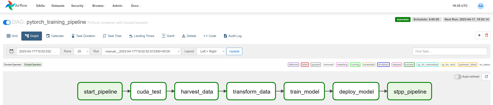

# pipeline_gen
[](https://travis-ci.com/yourusername/airflow-orchestration-environment)
[](https://hub.docker.com/r/yourusername/airflow-orchestration-environment)
[](https://opensource.org/licenses/MIT)

## TLDR
Avoid the regret of building Jupyter notebooks that end up in production.

Pipelines all the way down for the win!




## Goals
* Give Data Scientists a better way to start production data apps.
* Give Data Engineer better material for productionalization

## What's the point?
It's easy to implement ideas in jupyter, but it's difficult to implement and support Jupyter notebooks in production.  Produciton data apps need supportable and resilient data pipeline foundations.  Pipeline_gen helps you start your project with pipelines in mind.  

## Why Should You Care?
Depends on who you are:
* *just starting out in Data Science?** Do you want to make a good impression on Data Engineers during your technical interviews?  you set yourself apart by having at least breifly considered what the impacts of your future efforts may have on their weekends.
* **seasoned data scientist?**:  Hopefully you're already developing your EDA and model code with pipelines in mind.  Pipeline_gen ~~forces~~ guides  you  to develop code that can be more easily scaled up by the data engineering team.
* **seasoned data engineer?** Pipeline_Gen shouldn't be the tool for your production pipelines, but if provided to your data scientists, it will guide them towards producing more deployable and scalable code, making your future self happier :)
* **full stack data scientist?** (aka data scientist and data engineer) - you can productionalize this under limited situations, and maybe hold you off until your employer can hire a real data engineer. 

## Design Principles
0. **Seprate the orchestration from the data processing** Airflow by default expects to run code on the Airflow python itself. It's better to perform all data processing on a docker image designed and built for that purpose.  Airflow's DockerOperator conveniently provides a great pairing of the orchestrator and the pipeline environment.
1. **Customize Sparingly** Do not add what is not critical to a basic data pipeline.  The code should deviate as little as possible from the most basic implementation of airflow
2. **Steer the user toward** [**good data pipelining practices**](https://airflow.apache.org/docs/apache-airflow/stable/best-practices.html) such as atomicity and idemportency
3. **Keep the orchestrator out of the way** Airflow is an extremely powerful and flexible tool, but it can be daunting to new users who haven't considered the data engineering implications of data science deployemnt.
 4. **Make it as easy as possible to develop in** The application spins up a [local Jupyter Environment](http://localhost:8888/) powered by the pipeline
 5. **Develop with Ops in mind** Allows the developer to watch their pipelines grown from nothing. Use the [local Airflow](http://localhost:8080) to deploy, monitor, and troubleshoot your pipeline from inception
 6. **Test-Driven Development? Pipeline-Driven Development!**  Take [software engineering best practices](https://www.amazon.com/Clean-Code-Handbook-Software-Craftsmanship/dp/0132350882) and apply them to data.

## Motivation
Data apps **are** data pipelines. Pipeline_Gen helps data teams start projects with the end in mind.


## What this project ** is not **
Airflow has a world of capability that is not used in this project. Most Airflow folks don't even recommend using the docker-compose.yml that they package in the Airflow Documentation and instead recommend a Kubernetes deployment.  As such, this project isn't intended to run production apps.

## Prerequisites

To use this template, you'll need:

- [Docker](https://www.docker.com/) installed on your system
- [Git](https://git-scm.com/) for cloning the repository

## Quick Start

1. **Clone the repository**

   ```tbd```

2. **Build the Docker image**

    ```tbd```

3. **Start the Airflow environment**

    ```tbd```

4. **Access the Airflow web interface**

   Open your browser and navigate to `http://localhost:8080`. You should see the Airflow web interface with no pipelines.

## Usage

### Creating a New Data Pipeline
```tbd```

### Updating an Existing Data Pipeline
```tbd```
### Updating the Application
```tbd```
```
docker-compose down; ./clean_docker.sh ; ./build_pipeline_image.sh ; docker-compose up
```

## Contributing

please contact me at jason.anderson.professional [.at.] gmail.com if you want to collaborate on this


## Future ideas:
* build an interface to more easily allow pipelines to be natively developed in Jupyter, maybe by virtue of a new bridge package with decorators like the TaskFlow Api.
* Adding tools like mypy, linters, and vscode integration by default
* Add a Dockerfile for a tensorflow container
* Add example pipelines role modelling best practices